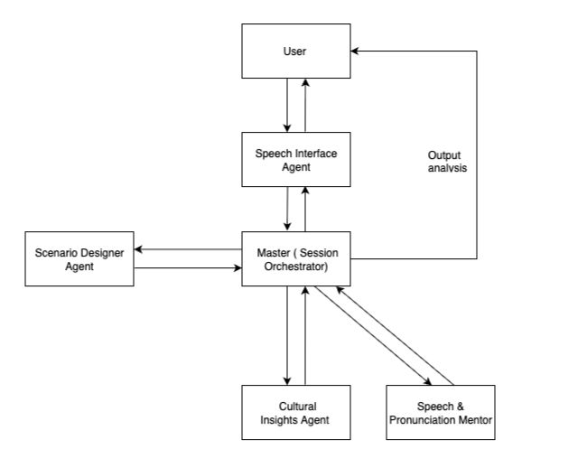

# 🧠 GenAI Agents – Interactive Language Simulator

This repository contains a **prototype implementation** of a multi-agent language learning system built on [genai-agentos](https://github.com/genai-works-org/genai-agentos). Our goal is to design a modular, extensible agentic architecture that enables realistic, culturally aware, multi-modal language practice—supporting text and speech interfaces.

This is an **early-stage prototype** showcasing the essential components of our system.

---

## 📎 This project is built on top of the genai-agentos repository, which served as the foundational framework for our hackathon prototype.

👉 [GitHub Repository](https://github.com/genai-works-org/genai-agentos)

---

## 🗺️ Project Overview

Our project builds an **agent-based architecture** where a **Master Agent** coordinates with multiple specialized **Sub-Agents** to support realistic, context-rich language learning.

Example use case: *Practicing conversational Hindi to buy vegetables from a local vendor at beginner level.*

---

## 🔁 High-Level System Flow



**Core Components:**

* Master Agent orchestrating dialogue
* Sub-Agents providing:

  * Cultural insights
  * Scenario scripting
  * Speech Mentor
  * Speech Interface Agent

---

## 📡 Communication

The **first milestone** is implementing communication between the **Master Agent** and the various **Sub-Agents** over text.

While our current prototype supports text-based interactions end-to-end, **speech-based communication with the Master Agent is a planned enhancement** .

---

## 📦 Prerequisites

Before you start, ensure you have:

✅ [Docker](https://www.docker.com/)
✅ [Docker Compose](https://docs.docker.com/compose/)
✅ [Python >= 3.12](https://www.python.org/downloads/)
✅ Make (for convenience scripts):

* macOS: `brew install make`
* Linux: `sudo apt-get install make`

---

## 🚀 Local Setup and Testing

### 1️⃣ Clone the repository

```bash
git clone https://github.com/missmayekar/Interactive-Language-Simulator.git
cd Interactive-Language-Simulator
```

### 2️⃣ Create a `.env` file

```bash
cp .env-example .env
```

* Ensure this file is configured with your secrets and environment variables.

### 3️⃣ Start Docker Desktop

* Confirm Docker is running before continuing.

### 4️⃣ Start the infrastructure

```bash
docker compose up
```

### 5️⃣ Access the UI

* Frontend available at: [http://localhost:3000/](http://localhost:3000/) 
**Note:** Make sure port 3000 is free on your machine. If it is in use by another service, update the `docker-compose.yml` to use a different port (e.g., 3001) and access the UI at that new port instead.


---

## ⚡ Quick Start – CLI Agents

### 1️⃣ User Registration

```bash
cd cli/
python cli.py signup -u <username>
python cli.py login -u <username> -p <password>
```

Alternatively, use the [Web UI](http://localhost:3000/) for signup and login.

---

## 👾 Available Models on frontend

* **OpenAI:** Uses the `gpt-4o` model in a custom configuration called *Simulator*.
* Paste your `system_promt.txt` into the Simulator system prompt field in the UI to customize master-agent behavior.

---

### 2️⃣ Run Sub-Agents

✅ **Cultural Insights Agent**

```bash
cd cli
python cli.py register_agent --name cultural_insights_agent  --description "“Generates Cultural Insights"
python cli.py register_agent --name speech_mentor  --description "analyses grammar and provides feedback"
python cli.py register_agent --name scenario_designer --description "Generates dialogues based on user-defined scenarios for language learning"
copy the <agemt>.py file from /agent_files


cd cli/agents/cultural_insights_agent
uv run python cultural_insights_agent.py
# or
python cultural_insights_agent.py
```

✅ **Scenario Designer Agent**

```bash
cd cli/agents/scenario_designer
uv run python scenario_designer.py
# or
python scenario_designer.py
```

✅ **Speech Mentor Agent**

```bash

cd cli/agents/speech_mentor
uv run python speech_mentor.py
# or
python speech_mentor.py
```

---

## 🎙️ Speech Interaction Prototype

After setting up the sub-agents, you can **simulate a conversation**:

* Use the master agent in the Web UI to generate a practice script.

  * Example prompt: *"Create a beginner-level Hindi script for buying vegetables from a local vendor."*

* Run the speech interface prototype:

```bash
python Speech_Interface_Agent.py
```

This script:

* Holds the computer side of the conversation using TTS
* Records the user's spoken input for analysis and feedback

You'll be prompted to:

* Select the script's language
* Paste the generated script

---

## 🛠️ Current Limitations & Future Work

✅ Text-based Master–Sub-Agent communication is fully implemented.
⚠️ Speech-to-Master-Agent integration remains in development.

**Planned enhancement:**

> Enable true back-and-forth voice-based interaction with the Master Agent, completing the conversational loop for immersive language practice.

---

## 💡 How to Use

1️⃣ Design a practice scenario in the UI
2️⃣ Run the corresponding Sub-Agent for scenario design
3️⃣ Launch the speech interface to simulate the interaction
4️⃣ Collect transcripts
5️⃣ Submit transcripts back to the Master Agent for:

* Cultural insights
* Grammar correction

---

## 🤝 Contributing Team

Neha Rajendra Mayekar
Madhulika S Sawant
Yukti Kajal Doshi

This is a prototype—issues, PRs, and feedback are welcome!


Developed as part of a hackathon project to showcase **AI agent collaboration for language learning**.